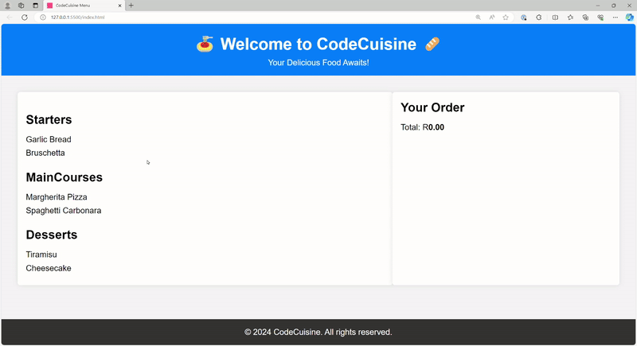

# [JSL06] Submission: CodeCuisine Menu Display System Challenge
# Project Overview:

In this coding projct, I will be building a simple menu display system for a fictional UberEats resturant called "CodeCuisine". The goal is to display different catergories of food items and allow users to add items to their order with a click. This project will help me apply various JavaScript concepts, including functions, closures, and event handling to create an interactive menu.

# Project Process

* Using the function called displayMenuItems() with the parameter set to menu which is taking in the variable which has an object with the keys and value which contains an array of the food items.
* Inside the displayMenuItems I fetched the element with the id menu and assigned it to a variable.
* I then have a for loop which sets the variables in an array of the object from the variable menu. Inside the loop, I create an H3 element which has it's content set to the category name which is the key from the object. I then add the H3 element into the "menu" element which is a section. I then created an unorganised list which i add into the menu section element.
* I then have a foreach loop which iterates through the items array which has a function which inside it I create a list element which has it's content being the parameter of the function. I then have an event listener on the list element which if clicked has a call back function which has the function inside it which add the item to the order list.
* I then have a function called addToOrder which adds item's to the order list.
* Inside this function I fetch elements from the DOM which are the unorganised list, the span element for total price and the button to clear order. I then created a list element and assigned it to a variable which I added to it's content the parameter of the function and added the list element to the unorganised list element. Using the parsefloat to assign the content from the HTML to a variable as a number instead of a string. Created a variable and have 60 assigned to it. The current price and item price is used to be assigned to a variable called newTotal which is used to be assigned to the span element for total price with a fixed two decimal places.
* I then added an eventlistener to the list elements so that if clicked the function inside the call back function removes the list element from the unorganised list.
* I also have another event listener added to the clear order button element which when clicked it calls back  a function which inside it the function that deletes all the list elements and sets the total price to 0.

# Challenges

No challenges for this project, I only struggled with adding the first additional feature which was to delete indiviual items from the order list and reduce the price based on what was deleted, it took some time and research to come up with a solution. Thanks to the solution I managed to come up with an extra feature to clear the order with one button to delete all list items and set total price to zero.

# Feedback

No feedback, only thing I can say is that I enjoyed the challenge and this helped spark my interest to apply additional features to what was initually required.
